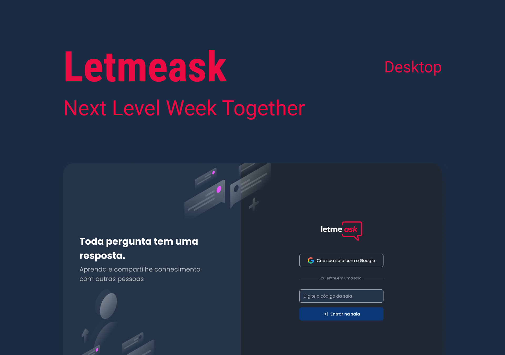

<h1 align="center">
    
</h1>

<h4 align="center">
  🚀 Next Level Week Together
</h4>

 

  

## :rocket: Technologies

This project was developed with the following technologies:

- [React](https://reactjs.org)
- [Firebase](https://firebase.google.com/?hl=pt)
- [Sass](https://sass-lang.com/)

## 💻 Project

Developed during the Next Level Week Together, focused on creating question rooms with features to add question, like, delete and highlight.
